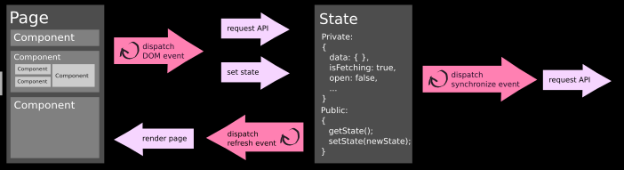

# Teste Frontend Leroy Merlin Brasil

### Front End Architecture



### Executando os testes

Executar um teste:
```
npm run test
```
Ativar testes automáticos:
```
npm run test:tdd
```

### Verificando estilo de codificação

Você pode verificar o estilo de codificação com o comando:
```
npm run lint
```

### Fazendo Build

Para fazer o build do produto, deve utilizar o comando:
```
npm run build
```
Modo escuta: 
```
npm run build:watch
```
Versão para produção (arquivo minificado):
```
npm run build:prod
```

## Ferramentas utilizadas

* [Webpack](https://webpack.js.org) - A static module bundler for modern JavaScript applications.
* [Babel](https://babeljs.io/) - The compiler for writing next generation JavaScript.
* [Mocha](https://mochajs.org/) - The fun, simple, flexible JavaScript test framework.
* [Chai](http://chaijs.com/) - A BDD / TDD assertion library for node and the browser that can be delightfully paired with any javascript testing framework.
* [ESLint](https://eslint.org/) - Pluggable JavaScript linter.


## Escopo do Teste
O desenvolvimento do teste se baseia numa interface já existente, encontrada na pasta deste projeto. Uma dashboard simples para visualização/interação de links externos.

O objetivo é avaliar a capacidade de estimativa do(a) desenvolvedor(a), em conjunto com a capacidade de se trabalhar com uma interface inacabada, e bons padrões de código.

A interface deve ser construida se baseando na imagem disponibilizada (interface.png), e parte do teste representa o desenvolvedor correr atrás de alguns aspectos da interface:

- Família de ícones
- Tipografia
- Motion para interação com os elementos da interface

Ou seja, só tem o png mesmo para se basear.

### Funcionalidade da interface
A interface deve atender os seguintes critérios:

- Permitir filtrar as postagens pela barra de pesquisa (Se eu digitar algo, deve filtrar pelo o que foi digitado, caso não encontre nada, mostrar um feedback).
- Filtrar as postagens a partir de filtros pré determinados
 - Popularidade
 - Data
 - Comentários

### Construção da interface
Em critérios de tecnologia, é esperado:

- Teste seja feito em Javascript Puro (Vanilla), utilizando ES6
- Teste **não** deve utilizar frameworks CSS (Bootstrap, Foundation e afins)
- Consumir [os dados json](https://www.mocky.io/v2/5a6bc16631000078341b8b77) para popular os links na interface
- Bons padrões de código (linters)
- Documentação de código
- Testes automatizados (TDD/BDD)
- Automatizador de tarefas
- Crossbrowser (IEegde+, Chrome e FF)
- Responsividade

#### Observações
- **Não** utilizar frameworks/bibliotecas como React/Vue.JS/Angular
- **Não** utilizar frameworks/bibliotecas de CSS
- O rodapé, links, ícones de usuários não precisam ter interação
- Vamos avaliar o histórico de commits
- Não tenha medo de fazer perguntas, de verdade
- Esse README pode ser substituído